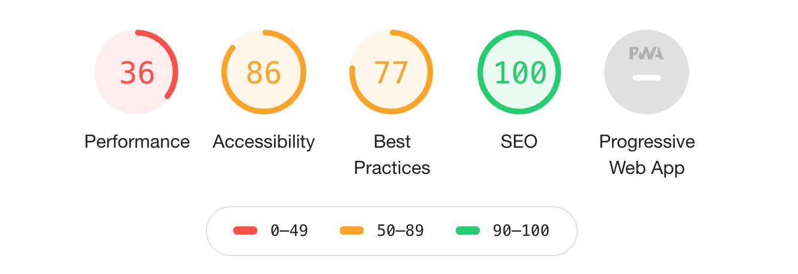
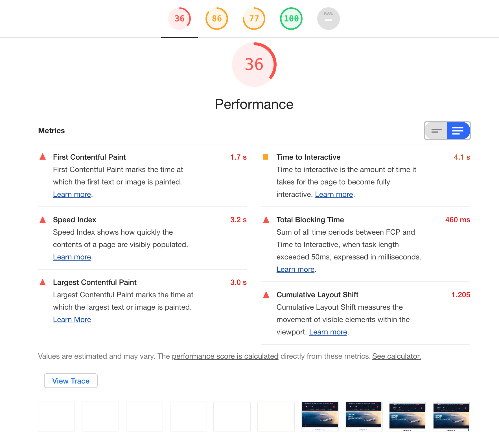
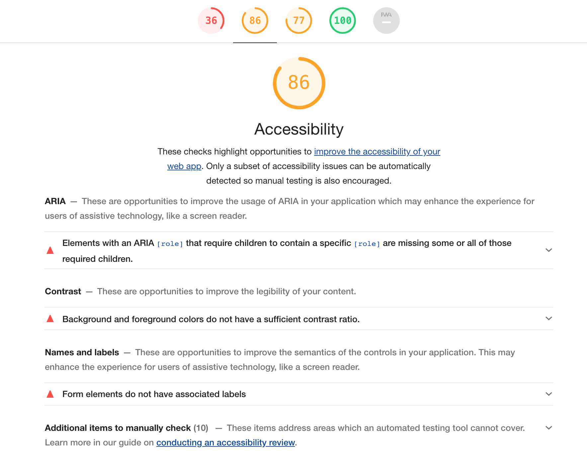
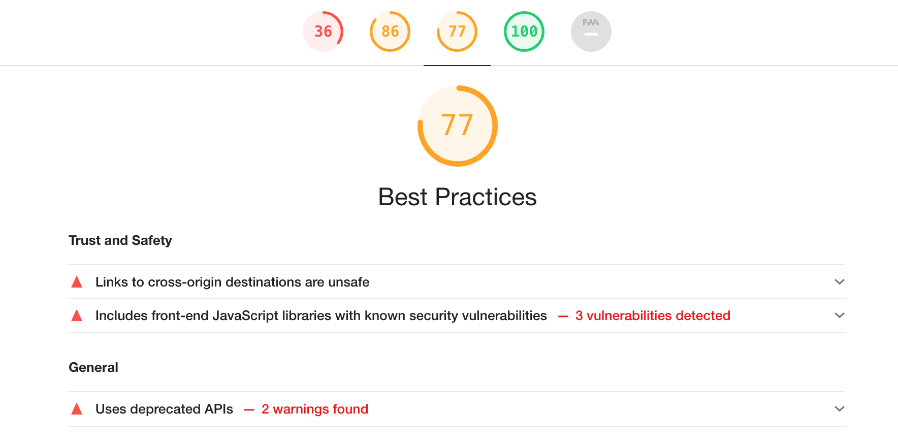
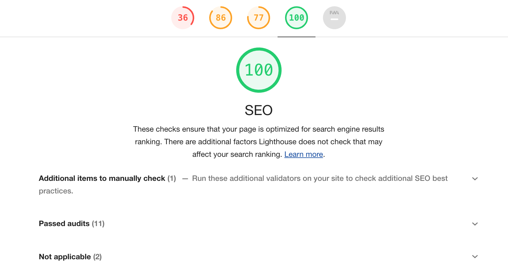
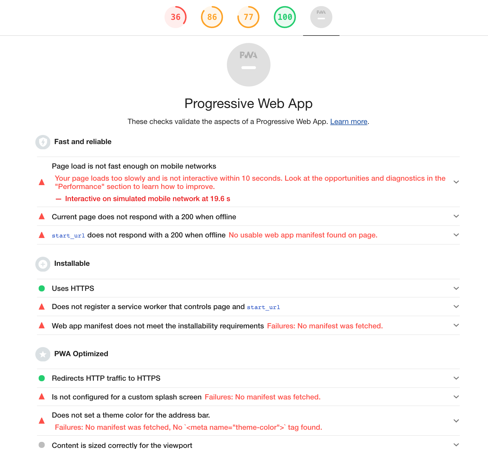
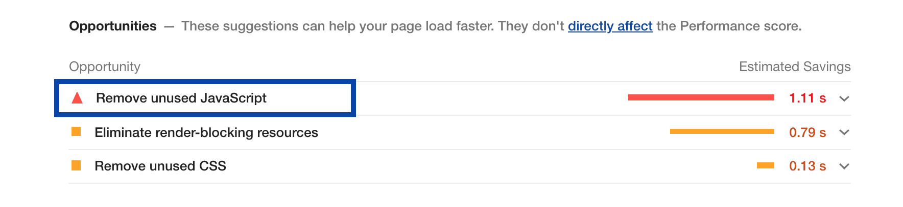
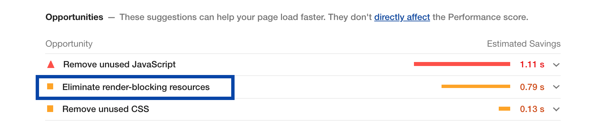
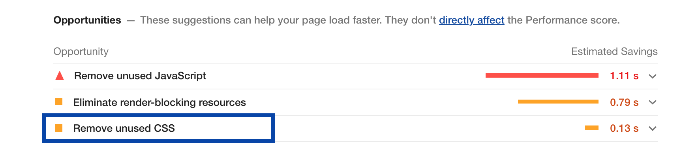

## Thanks


@snap[south-east span-100 text-03]
#TechCon ◆ #DeveloperCommunity

@snap[south-west span-100 text-11]
Chris DeMars ◆ @saltnburnem

---

### I ❤️ the #DeveloperCommunity

@snap[south-east span-100 text-03]
#TechCon ◆ #DeveloperCommunity

@snap[south-west span-100 text-11]
Chris DeMars ◆ @saltnburnem

---

@snap[north span-80]
@css[text-14](Hi, I'm Chris DeMars)
@saltnburnem

@snapend

@snap[south]


@snapend

---

### @css[emoji](😢)

@snap[south-east span-100 text-03]
#TechCon ◆ #DeveloperCommunity
@snap[south-west span-100 text-11]
Chris DeMars ◆ @saltnburnem

---

### More about me!

@ul

- International Speaker
- From Detroit - 313 BABY!
- Host of Tales From the Script (@TalesFTScript)
- Love tattoos and horror

  @ulend

  @snap[south-east span-100 text-03]
  #TechCon ◆ #DeveloperCommunity
  @snap[south-west span-100 text-11]
  Chris DeMars ◆ @saltnburnem

---

[Tales From the Script](https://open.spotify.com/show/6CMLm47Kj0VyeM6lnaSmnw?si=fS6s9ra1TMmREKJ7RyhGpQ)

@snap[south-east span-100 text-03]
#TechCon ◆ #DeveloperCommunity
@snap[south-west span-100 text-11]
Chris DeMars ◆ @saltnburnem

---

### @css[title](Run to the Light Carol Anne)

#### @css[title](Auditing with Lighthouse)


@snap[south-east span-100 text-03]
#TechCon ◆ #DeveloperCommunity
@snap[south-west span-100 text-11]
Chris DeMars ◆ @saltnburnem

---

## What is an audit?

@snap[south-east span-100 text-03]
#TechCon ◆ #DeveloperCommunity
@snap[south-west span-100 text-11]
Chris DeMars ◆ @saltnburnem

---

@quote[A web audit is an evaluation of the current state of a web page's adherence to specific standards of quality, be it performance, accessibility, security, or other aspects of a website's functioning.]

@snap[south-east span-100 text-03]
#TechCon ◆ #DeveloperCommunity
@snap[south-west span-100 text-11]
Chris DeMars ◆ @saltnburnem

@snapend
Note:

- According to Jeremy Wagner, Performance Engineer and Author, it’s an evaluation of the current state of a web page's adherence to specific standards of quality, be it performance, accessibility, security, or other aspects of a website's functioning.

---

## What can we audit?

---

### ⬇ THE THINGS ⬇

@ul

- Performance
- SEO (Search Engine Optimization)
- Best Practices
- PWA (Progressive Web App)
- Accessibility
  @ulend

  @snap[south-east span-100 text-03]
  #TechCon ◆ #DeveloperCommunity
  @snap[south-west span-100 text-11]
  Chris DeMars ◆ @saltnburnem

@snapend
Note:

- Performance as far as loading, specifically DomContentLoaded, time to first byte, first contentful paint, and optimizing the critical rendering path.
- Search engine optimzation, using the proper heading level elements, keywords, and description.
- Best practices, are you using the proper doctype, are there any console errors?
- For PWA's do you have a service worker and manifest file?
- My favorite topic, accessibility, how is the color contrast? Do you have alternative text for images? Are you using ARIA correctly?

---

## Performance


@snap[south-east span-100 text-03]
#TechCon ◆ #DeveloperCommunity
@snap[south-west span-100 text-11]
Chris DeMars ◆ @saltnburnem

@snapend
Note:

- This a screenshot of the performance tab in Chrome's DevTools. Based on the results you get from an audit you can really dig down into this chart and see load times, bottlenecks, etc.
- You can also pair this performance tab up with running your audit and compare and contrast the issues.

---

#### Performance Resource to Pair with Lighthouse

[Webpage Test](https://www.webpagetest.org/)

@snap[south-east span-100 text-03]
#TechCon ◆ #DeveloperCommunity
@snap[south-west span-100 text-11]
Chris DeMars ◆ @saltnburnem

---

## SEO

Keywords, Structure, Description, Google Analytics, etc.

[A Simple (But Effective) 31-Point SEO Checklist](https://ahrefs.com/blog/seo-checklist/)

@snap[south-east span-100 text-03]
#TechCon ◆ #DeveloperCommunity
@snap[south-west span-100 text-11]
Chris DeMars ◆ @saltnburnem

---

## Best Practices

Proper doctype, no console errors, etc.

@snap[south-east span-100 text-03]
#TechCon ◆ #DeveloperCommunity
@snap[south-west span-100 text-11]
Chris DeMars ◆ @saltnburnem

---

## @css[title](Security & HTTPS)

@snap[south-middle span-100 fragment]
@[2]

```html
<div class="...">
  <a href="..." target="_blank" rel="noopener noreferrer nofollow"></a>
</div>
```

@snapend

@snap[south-east span-100 text-03]
#TechCon ◆ #DeveloperCommunity
@snap[south-west span-100 text-11]
Chris DeMars ◆ @saltnburnem

@snapend
Note:

- All three of these attribute values have to do with the act of opening a link or tab in a web experience.
- The noopenere and noreferrer work against mailicious attacks caused by using the \_blank attribute value of the target attribute. This value gives access to the window.object and therefore partially links to the tab you just came from.
- When adding noopener and noreferrer it doesn't set the window.property and returns a null value.
- According to Point Jupiter, the rule general rule to use nofollow is on links and in forums.

---

## Progressive Web Apps

@snap[south-east span-100 text-03]
#TechCon ◆ #DeveloperCommunity
@snap[south-west span-100 text-11]
Chris DeMars ◆ @saltnburnem

---

@snap[north-east span-100 text-06]
Sample sw.js file
@snapend
@snap[span-100]

```javascript
if ('serviceWorker' in navigator) {
  window.addEventListener('load', function () {
    navigator.serviceWorker.register('/sw.js').then(
      function (registration) {
        // Registration was successful
        console.log(
          'ServiceWorker registration successful with scope: ',
          registration.scope
        );
      },
      function (err) {
        // registration failed :(
        console.log('ServiceWorker registration failed: ', err);
      }
    );
  });
}
```

@snapend

@snap[south-east span-100 text-03]
#TechCon ◆ #DeveloperCommunity
@snap[south-west span-100 text-11]
Chris DeMars ◆ @saltnburnem

@snapend
Note:

- According my friend Matt Gaunt over at Google, a service worker is: A script that your browser runs in the background, separate from a web page, opening the door to features that don't need a web page or user interaction.
- Two things you need to have a great progressive web app experience is a service worker javascript file and a manifest.json file.
- To install a service worker you need to register it in your page. This tells the browser where your service worker JS file lives. The code checks to see if it is available and if it is, it is registered once the page loads.

---

@snap[north-east span-100 text-06]
Sample manifest.json file
@snapend
@snap[span-100]

```javascript zoom-06
{
  "short_name": "Maps",
  "name": "Google Maps",
  "icons": [
    {
      "src": "/images/icons-192.png",
      "type": "image/png",
      "sizes": "192x192"
    },
    {
      "src": "/images/icons-512.png",
      "type": "image/png",
      "sizes": "512x512"
    }
  ],
  "start_url": "/maps/?source=pwa",
  "background_color": "#3367D6",
  "display": "standalone",
  "scope": "/maps/",
  "theme_color": "#3367D6"
}
```

@[2-4, zoom-21]
@[6-8, zoom-21]
@[11-13, zoom-21]
@[16-20, zoom-21]

@snapend

@snap[south-east span-100 text-03]
#TechCon ◆ #DeveloperCommunity
@snap[south-west span-100 text-11]
Chris DeMars ◆ @saltnburnem

@snapend
Note:

- A manifest.json file can be used to set add the site to the homescreen of your device with icons tailored to the device.
- Set the splash screen
- You can even specify the color scheme and whether or not you want to display browser chrome

---

@snap[north-east span-100 text-06]
Tell the browser about your manifest.json file
@snapend
@snap[span-100]

```html midpoint zoom-15
<link rel="manifest" href="/manifest.json" />
```

@snapend

@snap[south-east span-100 text-03]
#TechCon ◆ #DeveloperCommunity
@snap[south-west span-100 text-11]
Chris DeMars ◆ @saltnburnem

---

## @css[title](Accessibility)

@snap[south-east span-100 text-03]
#TechCon ◆ #DeveloperCommunity
@snap[south-west span-100 text-11]
Chris DeMars ◆ @saltnburnem

---

@snap[north-east span-100 text-06]
Semantic markup and ARIA
@snapend[west]

```html zoom-08
<header>
  <!--- Some code goes here --->
</header>
<section>
  <!--- Some code goes here --->
</section>
<div class="...">
  <ul>
    <li>
      <a href="#" aria-label="Facebook">
        <i class="fab fa-3x fa-facebook-f"></i>
      </a>
    </li>
    <li>
      <a href="#" aria-label="Instagram">
        <i class="fab fa-3x fa-instagram-f"></i>
      </a>
    </li>
    <li>
      <a href="#" aria-label="Twitter">
        <i class="fab fa-3x fa-twitter-f"></i>
      </a>
    </li>
  </ul>
</div>
<footer>
  <!--- Some code goes here --->
</footer>
```

@[1-3, zoom-15]
@[4-6, zoom-15]
@[9-13, zoom-15]
@[14-18, zoom-15]
@[19-23, zoom-15]
@[26-28, zoom-15]

@snap[south-east span-100 text-03]
#TechCon ◆ #DeveloperCommunity
@snap[south-west span-100 text-11]
Chris DeMars ◆ @saltnburnem

---

## How do we audit?

@snap[south-east span-100 text-03]
#TechCon ◆ #DeveloperCommunity
@snap[south-west span-100 text-11]
Chris DeMars ◆ @saltnburnem

---

@snap[midpoint lighthouse]

@snapend

@snap[south-east span-100 text-03]
#TechCon ◆ #DeveloperCommunity
@snap[south-west span-100 text-11]
Chris DeMars ◆ @saltnburnem

---

# ALWAYS

## Audit in incognito!

@snap[south-east span-100 text-03]
#TechCon ◆ #DeveloperCommunity

@snap[south-west span-100 text-11]
Chris DeMars ◆ @saltnburnem

---

## OFF WE GO TO CHROME!


@snap[south-east span-100 text-03]
#TechCon ◆ #DeveloperCommunity
@snap[south-west span-100 text-11]
Chris DeMars ◆ @saltnburnem

---

# Problems



@snap[south-east span-100 text-03]
#TechCon ◆ #DeveloperCommunity
@snap[south-west span-100 text-11]
Chris DeMars ◆ @saltnburnem

---



@snap[south-east span-100 text-03]
#TechCon ◆ #DeveloperCommunity
@snap[south-west span-100 text-11]
Chris DeMars ◆ @saltnburnem

---



@snap[south-east span-100 text-03]
#TechCon ◆ #DeveloperCommunity
@snap[south-west span-100 text-11]
Chris DeMars ◆ @saltnburnem

---



@snap[south-east span-100 text-03]
#TechCon ◆ #DeveloperCommunity
@snap[south-west span-100 text-11]
Chris DeMars ◆ @saltnburnem

---



@snap[south-east span-100 text-03]
#TechCon ◆ #DeveloperCommunity
@snap[south-west span-100 text-11]
Chris DeMars ◆ @saltnburnem

---



@snap[south-east span-100 text-03]
#TechCon ◆ #DeveloperCommunity
@snap[south-west span-100 text-11]
Chris DeMars ◆ @saltnburnem

---

# Solutions

@snap[south-east span-100 text-03]
#TechCon ◆ #DeveloperCommunity
@snap[south-west span-100 text-11]
Chris DeMars ◆ @saltnburnem

---

## Performance Solutions



@snap[south-east span-100 text-03]
#TechCon ◆ #DeveloperCommunity
@snap[south-west span-100 text-11]
Chris DeMars ◆ @saltnburnem

---

## Performance Solutions



@snap[south-east span-100 text-03]
#TechCon ◆ #DeveloperCommunity
@snap[south-west span-100 text-11]
Chris DeMars ◆ @saltnburnem

---

## Performance Solutions



@snap[south-east span-100 text-03]
#TechCon ◆ #DeveloperCommunity
@snap[south-west span-100 text-11]
Chris DeMars ◆ @saltnburnem

---

## Accessibility Solutions

@ul

- Use ARIA roles responsibly
- Fix the color contrast
- Ensure that forms have associated labels

  @ulend

  @snap[south-east span-100 text-03]
  #TechCon ◆ #DeveloperCommunity
  @snap[south-west span-100 text-11]
  Chris DeMars ◆ @saltnburnem

---

## Best Practice Solutions

@ul

- Make sure links are safe (`noopener noreferer`)
- Stay away from JS libraries or frameworks with security vulnerabilities (jQuery 3.2.1)

  @ulend

  @snap[south-east span-100 text-03]
  #TechCon ◆ #DeveloperCommunity
  @snap[south-west span-100 text-11]
  Chris DeMars ◆ @saltnburnem

---

## SEO Solutions

We are good!

  @ulend

  @snap[south-east span-100 text-03]
  #TechCon ◆ #DeveloperCommunity
  @snap[south-west span-100 text-11]
  Chris DeMars ◆ @saltnburnem

---

## BUT...if we HAD issues!

@ul

- Make sure there is a `<meta name="viewport">` tag
- Links should have discernible text
- The heading level hierachy should make sense

  @ulend

  @snap[south-east span-100 text-03]
  #TechCon ◆ #DeveloperCommunity
  @snap[south-west span-100 text-11]
  Chris DeMars ◆ @saltnburnem

---

## As far as a PWA goes?

@css[fragment](That is up to you and your company goals and initiatives.)

  @snap[south-east span-100 text-03]
  #TechCon ◆ #DeveloperCommunity
  @snap[south-west span-100 text-11]
  Chris DeMars ◆ @saltnburnem

---

## What did we learn?

@ul

- What a web audit is?
- How to run an audit in Lighthouse
- Identifying problems
- Creating solutions

  @ulend

  @snap[south-east span-100 text-03]
  #TechCon ◆ #DeveloperCommunity
  @snap[south-west span-100 text-11]
  Chris DeMars ◆ @saltnburnem

---

# Resources

[Get them here!](https://gist.github.com/chrisdemars/34305835a172f4e5aac3ed35b6b908af)

@snap[south-east span-100 text-03]
#TechCon ◆ #DeveloperCommunity
@snap[south-west span-100 text-11]
Chris DeMars ◆ @saltnburnem

---

# Thanks!

@saltnburnem | http://bit.ly/lighthouse-carol-anne

@snap[south-east span-100 text-03]
#TechCon ◆ #DeveloperCommunity
@snap[south-west span-100 text-11]
Chris DeMars ◆ @saltnburnem
