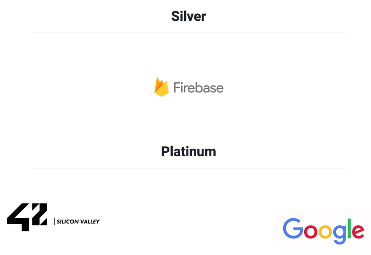

## Thanks to GDG Fremont!

@snap[south-east span-100 text-03]
#GDGFremontDevFest2020 ◆ #DeveloperCommunity

@snap[south-west span-100 text-11]
Chris DeMars ◆ @saltnburnem

---

@snap[north]

## Sponsors

@snapend

@snap[midpoint]

@snapend

@snap[south-east span-100 text-03]
#GDGFremontDevFest2020 ◆ #DeveloperCommunity

@snap[south-west span-100 text-11]
Chris DeMars ◆ @saltnburnem

---

### #GDGFremontDevFest2020

@snap[south-east span-100 text-03]
#GDGFremontDevFest2020 ◆ #DeveloperCommunity

@snap[south-west span-100 text-11]
Chris DeMars ◆ @saltnburnem

---

### I ❤️ the #DeveloperCommunity

@snap[south-east span-100 text-03]
#GDGFremontDevFest2020 ◆ #DeveloperCommunity

@snap[south-west span-100 text-11]
Chris DeMars ◆ @saltnburnem

---


@snap[north span-80]
@emoji[wave text-14] @css[text-14](Hi, I'm Chris DeMars)
@saltnburnem
@snapend

@snap[south-west fit]

@snapend

@snap[south-east fit]

@snapend

@snap[south]

@snapend

---

### @css[emoji](😢)

@snap[south-east span-100 text-03]
#GDGFremontDevFest2020 ◆ #DeveloperCommunity

@snap[south-west span-100 text-11]
Chris DeMars ◆ @saltnburnem

---

### More about me!

@ul

- International Speaker
- From Detroit but currently live in Denver
- Host of Tales From the Script (@TalesFTScript)
- Love tattoos and horror

  @ulend

  @snap[south-east span-100 text-03]
  #GDGFremontDevFest2020 ◆ #DeveloperCommunity

@snap[south-west span-100 text-11]
Chris DeMars ◆ @saltnburnem

---

[Tales From the Script](https://open.spotify.com/show/6CMLm47Kj0VyeM6lnaSmnw?si=fS6s9ra1TMmREKJ7RyhGpQ)

@snap[south-east span-100 text-03]
#GDGFremontDevFest2020 ◆ #DeveloperCommunity

@snap[south-west span-100 text-11]
Chris DeMars ◆ @saltnburnem

---

### @css[title](Run to the Light Carol Anne)

#### @css[title](Auditing with Lighthouse)


@snap[south-east span-100 text-03]
#GDGFremontDevFest2020 ◆ #DeveloperCommunity

@snap[south-west span-100 text-11]
Chris DeMars ◆ @saltnburnem

---

## What is an audit?

@snap[south-east span-100 text-03]
#GDGFremontDevFest2020 ◆ #DeveloperCommunity

@snap[south-west span-100 text-11]
Chris DeMars ◆ @saltnburnem

---

@quote[Analysis of how your experience is doing.]

@snap[south-east span-100 text-03]
#GDGFremontDevFest2020 ◆ #DeveloperCommunity

@snap[south-west span-100 text-11]
Chris DeMars ◆ @saltnburnem

---

@ul

- Performance
- SEO (Search Engine Optimization)
- Best Practices
- PWA (Progressive Web App)
- Accessibility
  @ulend

  @snap[south-east span-100 text-03]
  #GDGFremontDevFest2020 ◆ #DeveloperCommunity

@snap[south-west span-100 text-11]
Chris DeMars ◆ @saltnburnem

---

@snap[perf-ss]

@snapend

@snap[south-east span-100 text-03]
#GDGFremontDevFest2020 ◆ #DeveloperCommunity

@snap[south-west span-100 text-11]
Chris DeMars ◆ @saltnburnem

---

[Webpage Test](https://www.webpagetest.org/)

@snap[south-east span-100 text-03]
#GDGFremontDevFest2020 ◆ #DeveloperCommunity

@snap[south-west span-100 text-11]
Chris DeMars ◆ @saltnburnem

---

Keywords, Structure, Description, Google Analytics, etc.

[A Simple (But Effective) 31-Point SEO Checklist](https://ahrefs.com/blog/seo-checklist/)

@snap[south-east span-100 text-03]
#GDGFremontDevFest2020 ◆ #DeveloperCommunity

@snap[south-west span-100 text-11]
Chris DeMars ◆ @saltnburnem

---

## Best Practices

#### Proper doctype, no console errors, etc.

@snap[south-east span-100 text-03]
#GDGFremontDevFest2020 ◆ #DeveloperCommunity

@snap[south-west span-100 text-11]
Chris DeMars ◆ @saltnburnem

---

## @css[title](Security & HTTPS)

@snap[south-middle span-100 fragment]
@[2, zoom-18]

```html
<div class="...">
  <a href="..." rel="noopener"></a>
</div>
```

@snapend

@snap[south-east span-100 text-03]
#GDGFremontDevFest2020 ◆ #DeveloperCommunity

@snap[south-west span-100 text-11]
Chris DeMars ◆ @saltnburnem

---

## Progressive Web Apps

@snap[south-east span-100 text-03]
#GDGFremontDevFest2020 ◆ #DeveloperCommunity

@snap[south-west span-100 text-11]
Chris DeMars ◆ @saltnburnem

---

@snap[north-east span-100 text-06]
Sample sw.js file
@snapend
@snap[span-100]

```javascript
if ('serviceWorker' in navigator) {
  window.addEventListener('load', function() {
    navigator.serviceWorker.register('/sw.js').then(
      function(registration) {
        // Registration was successful
        console.log(
          'ServiceWorker registration successful with scope: ',
          registration.scope
        );
      },
      function(err) {
        // registration failed :(
        console.log('ServiceWorker registration failed: ', err);
      }
    );
  });
}
```

@snapend

@snap[south-east span-100 text-03]
#GDGFremontDevFest2020 ◆ #DeveloperCommunity

@snap[south-west span-100 text-11]
Chris DeMars ◆ @saltnburnem

---

@snap[north-east span-100 text-06]
Sample manifest.json file
@snapend
@snap[span-100]

```javascript zoom-06
{
  "short_name": "Maps",
  "name": "Google Maps",
  "icons": [
    {
      "src": "/images/icons-192.png",
      "type": "image/png",
      "sizes": "192x192"
    },
    {
      "src": "/images/icons-512.png",
      "type": "image/png",
      "sizes": "512x512"
    }
  ],
  "start_url": "/maps/?source=pwa",
  "background_color": "#3367D6",
  "display": "standalone",
  "scope": "/maps/",
  "theme_color": "#3367D6"
}
```

@[2-4, zoom-21]
@[6-8, zoom-21]
@[11-13, zoom-21]
@[16-20, zoom-21]

@snapend

@snap[south-east span-100 text-03]
#GDGFremontDevFest2020 ◆ #DeveloperCommunity

@snap[south-west span-100 text-11]
Chris DeMars ◆ @saltnburnem

---

@snap[north-east span-100 text-06]
Tell the browser about your manifest.json file
@snapend
@snap[span-100]

```html midpoint zoom-15
<link rel="manifest" href="/manifest.json" />
```

@snapend

@snap[south-east span-100 text-03]
#GDGFremontDevFest2020 ◆ #DeveloperCommunity

@snap[south-west span-100 text-11]
Chris DeMars ◆ @saltnburnem

---

## @css[title](Accessibility)

@snap[south-east span-100 text-03]
#GDGFremontDevFest2020 ◆ #DeveloperCommunity

@snap[south-west span-100 text-11]
Chris DeMars ◆ @saltnburnem

---

@snap[north-east span-100 text-06]
Semantic markup and ARIA
@snapend[west]

```html zoom-06
<header>
  <!--- Some code goes here --->
</header>
<section>
  <!--- Some code goes here --->
</section>
<div class="...">
  <ul>
    <li aria-label="some label">
      <a href="#" aria-label="Facebook"
        ><i class="fab fa-3x fa-facebook-f"></i
      ></a>
    </li>
    <li aria-label="some label">
      <a href="#" aria-label="Instagram"
        ><i class="fab fa-3x fa-instagram-f"></i
      ></a>
    </li>
    <li aria-label="some label">
      <a href="#" aria-label="Twitter"
        ><i class="fab fa-3x fa-twitter-f"></i
      ></a>
    </li>
  </ul>
</div>
<footer>
  <!--- Some code goes here --->
</footer>
```

@[1-3, zoom-15]
@[4-6, zoom-15]
@[9-13, zoom-15]
@[14-18, zoom-15]
@[19-23, zoom-15]
@[26-28, zoom-15]

@snap[south-east span-100 text-03]
#GDGFremontDevFest2020 ◆ #DeveloperCommunity

@snap[south-west span-100 text-11]
Chris DeMars ◆ @saltnburnem

---

## How do we audit?

@snap[south-east span-100 text-03]
#GDGFremontDevFest2020 ◆ #DeveloperCommunity

@snap[south-west span-100 text-11]
Chris DeMars ◆ @saltnburnem

---

@snap[midpoint lighthouse]

@snapend

@snap[south-east span-100 text-03]
#GDGFremontDevFest2020 ◆ #DeveloperCommunity

@snap[south-west span-100 text-11]
Chris DeMars ◆ @saltnburnem

---

# ALWAYS

## Audit in incognito!

---

## OFF WE GO TO CHROME!


@snap[south-east span-100 text-03]
#GDGFremontDevFest2020 ◆ #DeveloperCommunity

@snap[south-west span-100 text-11]
Chris DeMars ◆ @saltnburnem

---

# Problems

@snap[south-east span-100 text-03]
#GDGFremontDevFest2020 ◆ #DeveloperCommunity

@snap[south-west span-100 text-11]
Chris DeMars ◆ @saltnburnem

---

# Solutions

@snap[south-east span-100 text-03]
#GDGFremontDevFest2020 ◆ #DeveloperCommunity

@snap[south-west span-100 text-11]
Chris DeMars ◆ @saltnburnem

---

# Resources

[Get them here!](https://gist.github.com/chrisdemars/34305835a172f4e5aac3ed35b6b908af)

@snap[south-east span-100 text-03]
#GDGFremontDevFest2020 ◆ #DeveloperCommunity

@snap[south-west span-100 text-11]
Chris DeMars ◆ @saltnburnem

---

# Thanks!

@saltnburnem | http://bit.ly/lighthouse-carol-anne

@snap[south-east span-100 text-03]
#GDGFremontDevFest2020 ◆ #DeveloperCommunity

@snap[south-west span-100 text-11]
Chris DeMars ◆ @saltnburnem
